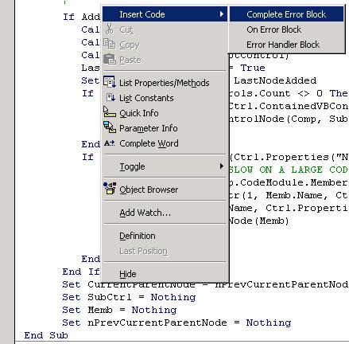



## Code Inserter

### Description

This VB IDE AddIn will add a Menu Item to the Code Editor window's PopUp Menu. The menu item created has sub menus which when selected will automatically place code into the current procedure. The code is contained in a text file for easy maintenance.

This is probably the simplest VB AddIn you could possibly wish for so if you want an introduction to AddIns... This is It!

Again I have used my style of small procedures for nice neat and easy to understand and comments to help explai certain items. The code is commented and areas that you will need to customize for your own purpose identified.

I hope that this is as useful to others as it is to me. Please leave comments I really appreciate the feedback and vote if you feel the urge, but please leave a comment.
 
### More Info
 

             |
---                |---
**Submitted On**   |2002-10-27 12:41:40
**By**             |[Darryl Hasieber](https://github.com/Planet-Source-Code/PSCIndex/blob/master/ByAuthor/darryl-hasieber.md)
**Level**          |Beginner
**User Rating**    |4.8 (19 globes from 4 users)
**Compatibility**  |VB 6\.0
**Category**       |[Miscellaneous](https://github.com/Planet-Source-Code/PSCIndex/blob/master/ByCategory/miscellaneous__1-1.md)
**World**          |[Visual Basic](https://github.com/Planet-Source-Code/PSCIndex/blob/master/ByWorld/visual-basic.md)
**Archive File**   |[Code\_Inser14893910302002\.zip](https://github.com/Planet-Source-Code/darryl-hasieber-code-inserter__1-40247/archive/master.zip)

